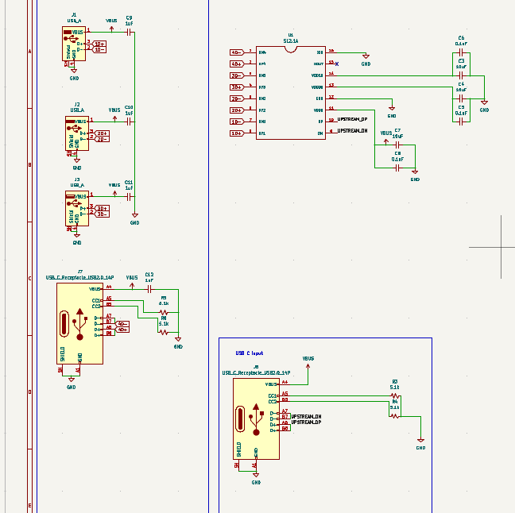
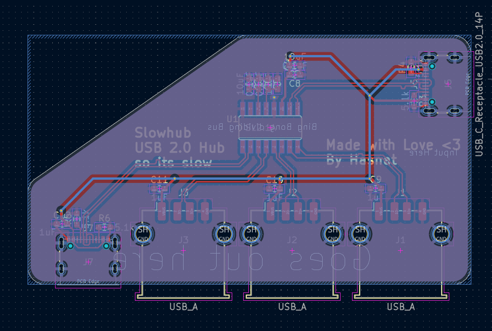
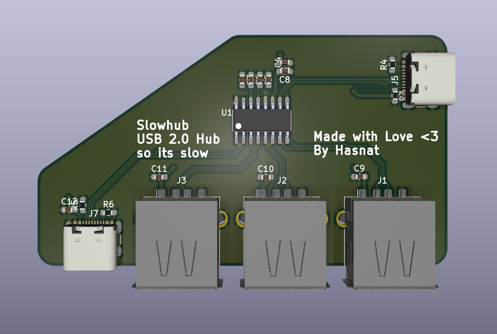
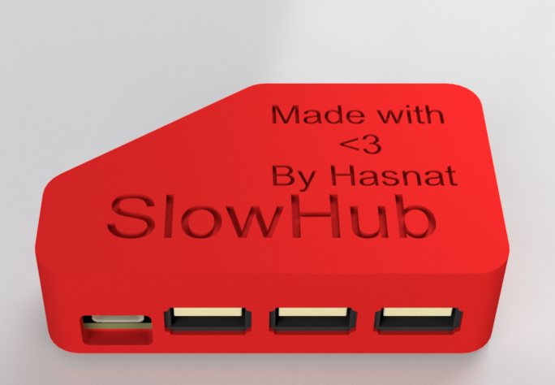
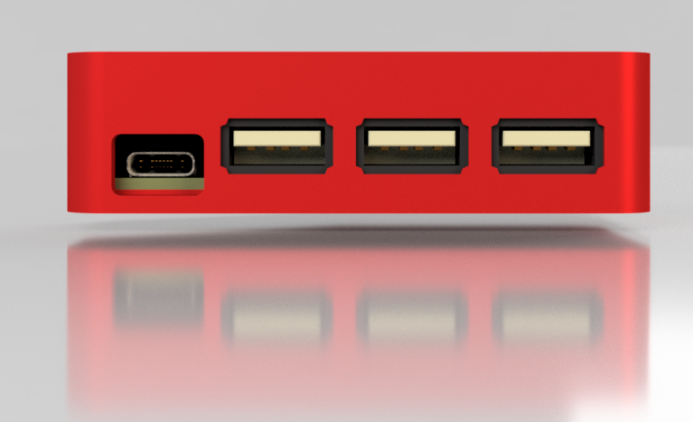
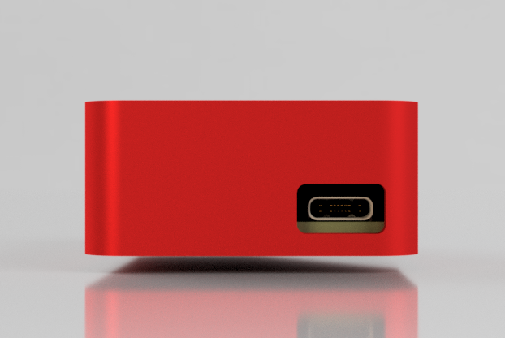
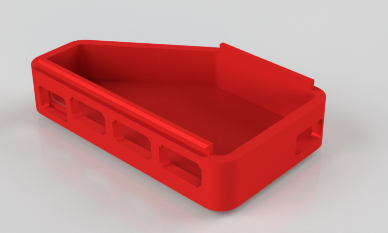

# Slowhub

A USB 2.0 hub based on the SL2.1A

# Why did I make it

I had designed another USB 2.0 hub with the same chip before, but I did not have a lot of experience Back then so when I received the PCB, the hub was not fully working, the audio Input/Output part was working great but It could not handle connecting USB peripherals like Pendrives and Keyboard/Mouse. So I decided to design another USB Hub with it to fix the past mistakes. 

# Gallery

## PCB

# Schematic

# PCB

# Case

# BOM

| Part name | Quantity | Price | Product Link |
|--------------------------------------------------|----------|----------------|------|
| SL2.A USB HUB IC | 5 | $1.40 | [Link](https://www.aliexpress.com/item/1005005552905296.html) |
| USB A Female Port | 10 | $5.68 | [Link](https://www.aliexpress.com/item/1005010243685669.html) |
| USB C Female Port (TYPE-C-02) | 10 | $2.06 | [Link](https://www.aliexpress.com/item/1005005371954812.html) |
| Capacitor Kit (0.1uF, 1uf, 10uF) | 1 | $3.67 | [Link](https://www.aliexpress.com/item/1005007293819361.html) |
| 5.1k Resistor 0603 | 100 | $1.73 | [Link](https://www.aliexpress.com/item/1005008152622017.html) |
| PCB | 5 | $0.18 | JLCPCB |
| 3D printed Case Parts | 2 | Printing Legion | Printing Legion HC |

# Build instruction

You will have to use SMD soldering for soldering 90% of the parts. you may need a stencil if you want to use a hot plate, but a soldering iron can be used too.

# Zine